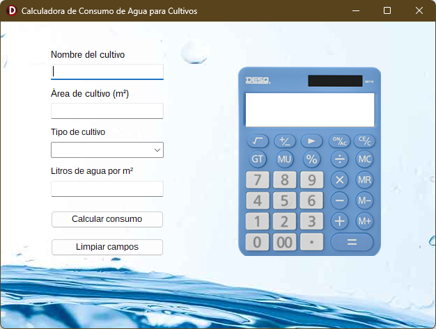
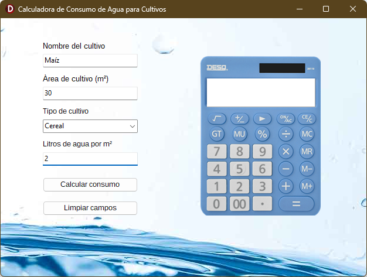
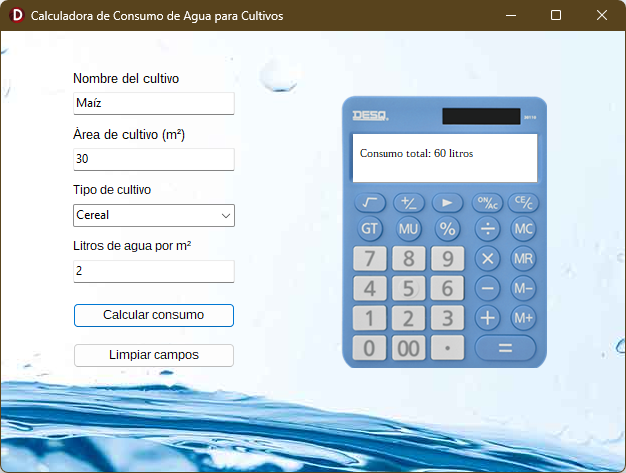

# Calculadora de Consumo de Agua 💧

Aplicación desarrollada en **Delphi** para calcular el consumo total de agua de un cultivo según su área y necesidad hídrica por metro cuadrado.

## ✨ Características
- Introducción de datos: área cultivada y litros de agua por m².  
- Cálculo automático del consumo total en litros.  

## 🛠️ Tecnologías
- Delphi VCL  
- Object Pascal

## 📸 Capturas de pantalla

